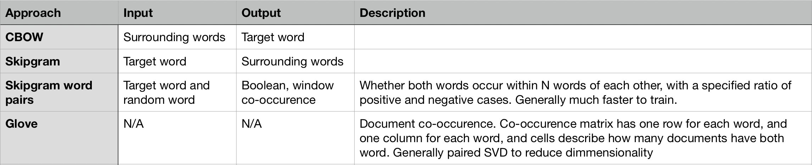

# Cheat sheet: Training deep learning embeddings

**tl;dr:** TODO 

TODO Hero image

## What are embeddings?

Words are tough. Words are particularly tough in Machine Learning, where most algorithms are designed an optimized to
 work on numbers & vectors, and not (seemingly arbitrary) lists of characters. Until recently, the highly specialized 
 field of Natural Language Processing (NLP) has curated approaches and algorithms that can work on words, and to be 
 honest the results have been mixed. 

However, newer approaches have focused on finding vectors than can accurately represent words, and then using 
standard vector-based approaches. There are lots of tutorials focusing on mechanics of creating embeddings, so I'd 
like to focus instead on approaches for creating supervised training sets to train or pre-train your embedding.

## Why train my own emebedings?

Short answer: Don't. Use a pretrained embedding, such as 

## Different approaches

Before we get to far, let's have a quick compare and contrast between the contenders:

Now, let's dig a little bit deeper into each option

### CBOW

**Synopsis:** Predict surrounding words, given target word
**Parameters:** 
 - Window size
**Example:** 
 - Parameters: Window size of 3
 - Raw text: the quick brown fox jumps over the lazy dog
 - Input: fox (replaced w/ vector representation)
 - Output [the, quick, brown, jumps, over, the]

### skipgram

**Synopsis:** Predict target word, given surrounding words
**Parameters:** 
 - Window size
**Example:** 
 - Parameters: Window size of 3
 - Raw text: the quick brown fox jumps over the lazy dog
 - Input: [the, quick, brown, jumps, over, the] (replaced w/ vector representation)
 - Output: fox 

### Skipgram word pairs

**Synopsis:** Generate pairs of words that co-occur in a window, and a pair of words that don't co-occur in that window 
**Parameters:** 
 - Window size
**Example:** 
 - Parameters: Window size of 3
 - Raw text: the quick brown fox jumps over the lazy dog
 - Input 1: quick, brown (replaced w/ vector representation)
 - Output 1: True
 - Input 2: quick, chicken (replaced w/ vector representation)
 - Output 2: False

### Glove

**Synopsis:** Use word co-occurence counts to represent those words  
**Parameters:** 
**Example:** 
 - A bit beyound the scope of this blog post

## Best path forward

If you're looking for a good default, you should probably use a pre-trained embedding. If

### Suggested reading

[Distributed Representations of Words and Phrases
and their Compositionality](https://papers.nips
.cc/paper/5021-distributed-representations-of-words-and-phrases-and-their-compositionality.pdf)

[Efficient Estimation of Word Representations in
Vector Space](https://arxiv.org/pdf/1301.3781.pdf)

[A Primer on Neural Network Models
for Natural Language Processing](https://arxiv.org/pdf/1510.00726.pdf)
